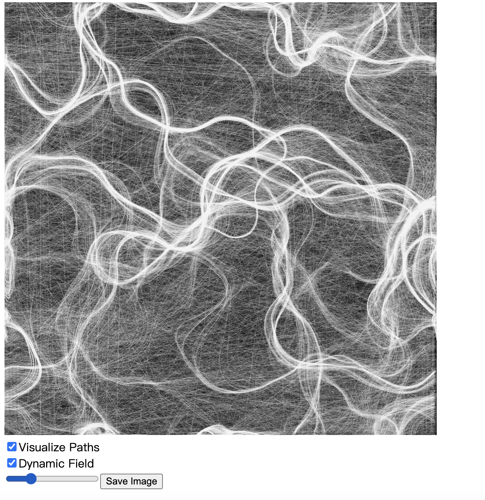
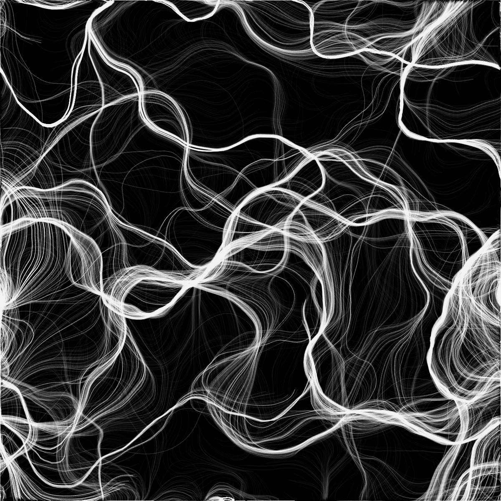
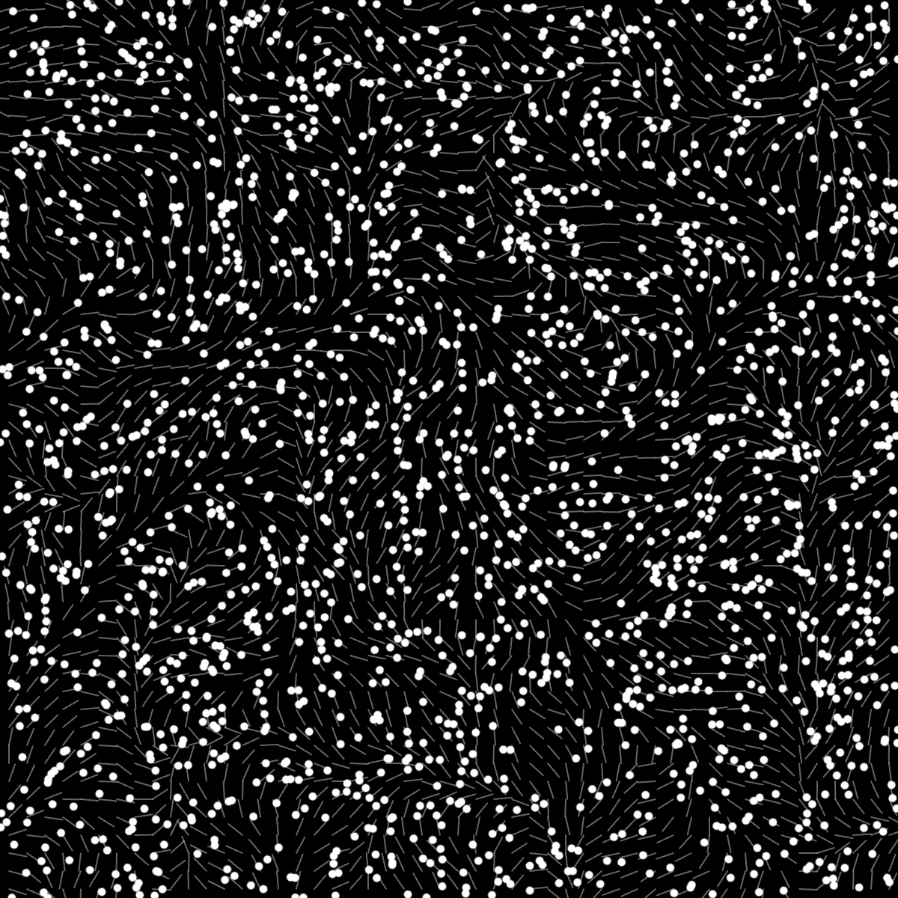
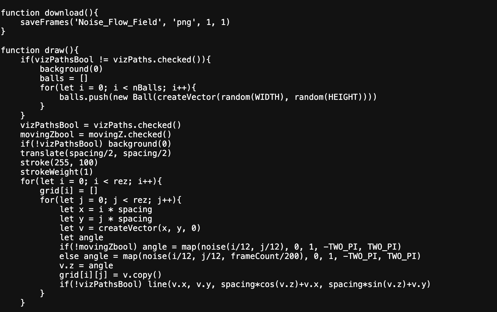

# jliu0093_9103_quiz8

### Imaging Technique Inspiration

The image that inspired me is "Perlin Noise Flow Field" by Miguel Rodríguez. The image formation changes each time based on adjustments to the visualize path, dynamic field and drag slider controls. The image can be represented as particle motion trajectories or smooth lines, can appear complex or simple. I believe this imaging technique offers great creative potential for my upcoming major assignment.

### Coding Technique Exploration

Miguel Rodríguez used Perlin Noise which is a type of smooth pseudo-random noise, used to generate natural random patterns. It is often employed to simulate random variations in natural phenomena such as clouds and smoke. In the video games, Perlin Noise can be used to generate continuous terrain. I think this coding technique, combined with other coding controls for motion trajectories, can result in highly artistic visuals. It will be helpful for my major assignment.

